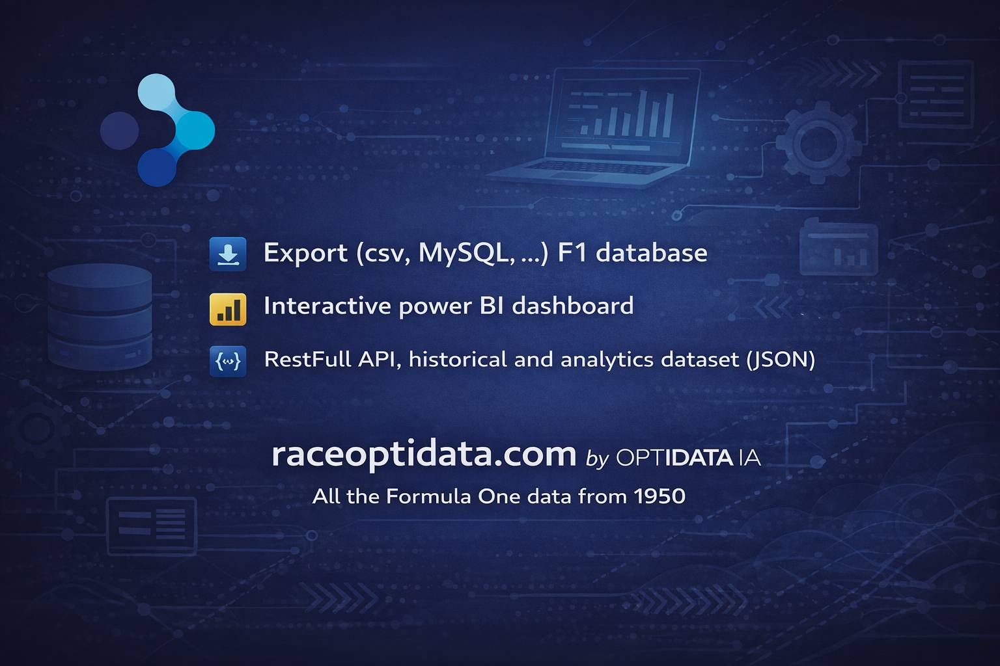

The RaceOptiData API gives access to real-time and historical Formula 1 data via a robust REST interface.

# RaceOptiData – Extended API Documentation

This repository provides extended documentation for the **RaceOptiData API**, including:

- Detailed descriptions of available endpoints
- Example requests and responses
- Usage guidelines and best practices

## 🔗 Quick Link

- [Swagger UI Documentation](https://www.raceoptidata.com/swagger.html)

## About the API

RaceOptiData aggregates data from two major sources:

- **Ergast**: Historical Formula 1 data since 1950 (drivers, circuits, results, standings, etc.)
- **FastF1**: Advanced telemetry and analytics (lap times, sectors, tyre strategies, weather, etc.)

Ideal for developers, analysts, and F1 enthusiasts who want to build apps, dashboards, and data models.

